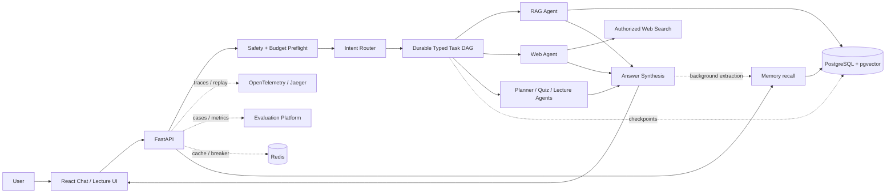

# TeacherAgent

[](https://github.com/Shengyuan-Liu/teacher-agent/actions/workflows/ci.yml)
[](backend/pyproject.toml)
[](frontend/package.json)
[](LICENSE)

> Turn personal learning materials into a grounded, interactive course—with
> inspectable multi-agent execution, durable recovery, and production-grade
> evaluation.

TeacherAgent is an AI learning workspace built as an **AI engineering portfolio
project**. It ingests PDFs, office documents, websites, documentation sites, and
GitHub repositories, then supports source-grounded chat, study planning,
assessment, mastery tracking, and interactive lectures.

The product is useful, but the main engineering focus is the system behind it:
typed orchestration, model routing, retrieval quality, prompt versioning,
observability, replay, safety, cost control, and reproducible evaluation.

## What This Project Demonstrates

- **Reliable agent orchestration** — a typed task DAG with explicit dependencies,
  topological concurrency, PostgreSQL node checkpoints, worker leases, retries,
  failure propagation, idempotency, and restart recovery.
- **Multi-agent coordination** — a single query can fan out to RAG and Web agents,
  merge their evidence, and invoke one Answer agent for coherent synthesis and
  unified citations.
- **Tiered model routing** — lightweight routing and classification tasks use a
  fast model tier; reasoning and user-facing synthesis can use a smarter tier.
  Every stage records its model, reasoning effort, latency, tokens, and cost.
- **Evaluation as infrastructure** — versioned datasets, suites, per-case results,
  model and prompt snapshots, baseline comparisons, confidence intervals, and CI
  regression gates.
- **Production controls** — OpenTelemetry traces, isolated replay, immutable prompt
  versions, red-team suites, per-turn budgets, tenant-isolated caches,
  single-flight request coalescing, and Redis-backed circuit breakers.
- **User-governed long-term memory** — background LangMem extraction, cross-session
  pgvector recall, conflict consolidation, confidence decay, expiry, and a complete
  view/edit/delete surface where user-confirmed facts override automatic updates.

## Architecture



Most learning interactions are initiated through Chat. Lecture is exposed as a
first-class sibling surface because it maintains long-running, resumable teaching
sessions. When the Router is uncertain, it returns explicit options and lets the
user choose the next direction instead of silently guessing.

## Product Capabilities

- Ingest PDF, Word, PowerPoint, Excel, Markdown, URLs, documentation sites, and
  GitHub repositories.
- Answer with traceable citations and open the original PDF at the cited page.
- Generate phased study plans from a learner's goal and time budget.
- Create multiple-choice, fill-in-the-blank, and free-response questions, then
  verify that their answers are supported by the source material.
- Run timed assessments, grade objective and subjective answers, maintain an error
  notebook, and schedule spaced review.
- Update topic mastery from assessment outcomes and use it to influence later
  plans and questions.
- Deliver structured explanations and resumable interactive lectures that can
  pause for questions and continue from the same checkpoint.
- Show the complete call chain—including Router decisions, agent outputs, model
  tiers, reasoning effort, token usage, latency, cost, retries, and checkpoints.
- Learn durable preferences, relevant background, and long-term goals from normal
  chats; recall them across sessions; and let the user inspect, correct, or delete
  every stored memory.

Web search is disabled by default and only runs after explicit user authorization.
If the available evidence is insufficient, the answer flow is designed to say so
instead of filling the gap with unsupported claims.

## Engineering Evidence

| Area | Implementation | Reproducible evidence |
|---|---|---|
| Durable orchestration | Typed DAG, blackboard, PostgreSQL checkpoints, leases, resume | [Design](docs/12-typed-task-dag.md) |
| Evaluation | Dataset/suite/run/result model, baselines, CI gates | [Evaluation platform](docs/10-evaluation-platform.md) |
| Observability | OpenTelemetry spans, agent waterfall, usage aggregation, replay | [Observability and replay](docs/11-observability-replay.md) |
| Prompt operations | Immutable versions, variable contracts, hashes, activation and rollback | [Prompt Registry](docs/15-prompt-registry.md) |
| Agent security | Four trust boundaries, quarantine/redaction, consent gates, red-team CI | [Security and red-team evaluation](docs/16-agent-security-red-team.md) |
| Resource governance | Budget reservations, tier downgrade, cache isolation, distributed breakers | [Resource governance](docs/17-resource-governance.md) |
| Resilience | Retry, permanent failure, budget contention, cache stampede, circuit recovery | [Load and fault testing](docs/18-resilience-load-testing.md) |
| Long-term memory | LangMem consolidation, pgvector recall, decay/expiry, user CRUD and tenant isolation | [Long-term memory](docs/19-long-term-memory.md) |
| Engineering decisions | Failure, root cause, fix, verification, trade-offs, remaining limits | [Agent engineering log](docs/13-agent-engineering-log.md) |

### Multi-Agent Benchmark

The benchmark compares four strategies on the same cases:

1. `single_agent`
2. `typed_dag`
3. `sequential_dag`
4. `no_synthesis`

The published live pilot contains 48 samples: four cases × four strategies × three
repeats. It records answer quality, claim recall, citation coverage, P50/P95
critical-path latency, tokens, agent calls, and actual model cost.

| Strategy | Pass rate | Mean quality (95% CI) | P50/P95 critical path | Mean tokens | Mean cost |
|---|---:|---:|---:|---:|---:|
| `single_agent` | 75.0% | 0.950 (0.900–1.000) | 1.51s / 1.98s | 160.9 | $0.0010 |
| `typed_dag` | 25.0% | 0.804 (0.716–0.885) | 3.58s / 7.64s | 440.2 | $0.0023 |
| `sequential_dag` | 41.7% | 0.787 (0.710–0.863) | 4.34s / 6.83s | 432.2 | $0.0022 |
| `no_synthesis` | 50.0% | 0.806 (0.725–0.879) | 1.22s / 1.79s | 219.8 | $0.0005 |

The result does **not** claim that multi-agent systems are inherently better. In
this small live pilot, the single-agent baseline achieved the highest quality.
The typed DAG primarily demonstrates controllable decomposition, concurrency,
recovery, observability, and governance. Larger fixed-model experiments are still
needed before making a quality claim.

See the [live report](docs/reports/multi-agent-live.md), the
[deterministic report](docs/reports/multi-agent-deterministic.md), and the
[methodology and limitations](docs/14-multi-agent-benchmark.md).

### Load and Fault Testing

The model-free resilience profile runs 200 turns per DAG scenario at concurrency
50:

- transient timeouts recovered 200/200 turns after bounded retry;
- permanent timeouts blocked 200/200 downstream synthesis nodes;
- a 12-call hard budget admitted exactly 12 of 50 contenders;
- 50 identical cache requests triggered one computation and coalesced 49;
- circuit recovery allowed one half-open probe before returning to `closed`.

An HTTP readiness profile completed 500/500 requests at concurrency 50 with
**235.247 ms P95**, passing the configured 99% availability / 500 ms P95 SLO.
These results cover orchestration and service readiness; they do not pretend to be
a production end-to-end LLM latency benchmark.

See the [resilience report](docs/reports/agent-resilience.md) and
[HTTP profile](docs/reports/http-readiness.json).

## Quick Start

Prerequisites:

- Docker
- [uv](https://docs.astral.sh/uv/)
- Node.js 20+
- pnpm

```bash
git clone https://github.com/Shengyuan-Liu/teacher-agent.git
cd teacher-agent

make setup  # Start PostgreSQL/Redis, install dependencies, run migrations
make dev    # Start the API, worker, and frontend
```

Open:

- Application: <http://localhost:5300>
- FastAPI documentation: <http://localhost:8000/docs>
- Jaeger UI after `make observability-up`: <http://localhost:16686>

The application can boot without a model API key, but model-backed features will
remain unavailable.

## Reproduce the Quality Gates

The fast evaluation, deterministic benchmark, and resilience profile do not
require a model API key:

```bash
make test
make eval-fast
make benchmark-report
make resilience-report
make http-load  # Requires the backend to be running
```

Run the API with local OTLP export:

```bash
make observability-up
make observability-backend
```

## Configuration

```bash
cp .env.example .env
```

| Variable | Purpose |
|---|---|
| `LLM_PROVIDER` | `anthropic`, `openai`, or `ollama` |
| `LLM_FAST_MODEL` / `LLM_SMART_MODEL` | Optional fast/smart model-tier overrides |
| `ANTHROPIC_API_KEY` / `OPENAI_API_KEY` | Provider credentials |
| `WEB_SEARCH_ENABLED` | Deployment-level web-search switch; disabled by default |
| `OBSERVABILITY_ENABLED` / `OTEL_TRACES_EXPORTER` | Persist agent traces and export via `none`, `otlp`, or `console` |
| `OTEL_CAPTURE_CONTENT` | Retain replay input in PostgreSQL; metrics remain available when disabled |
| `TASK_DAG_MAX_NODES` / `TASK_DAG_NODE_TIMEOUT_SECONDS` | DAG size and node timeout limits |
| `TASK_DAG_MAX_ATTEMPTS` / `TASK_DAG_LEASE_SECONDS` | Retry limit and durable worker lease |
| `PROMPT_CACHE_TTL_SECONDS` | Active workspace prompt cache TTL |
| `TURN_BUDGET_MAX_MODEL_CALLS` / `TURN_BUDGET_MAX_TOKENS` / `TURN_BUDGET_MAX_COST_USD` | Hard limits for one Chat turn |
| `TURN_BUDGET_SOFT_RATIO` | Threshold for downgrading new Smart calls to Fast |
| `ROUTER_CACHE_TTL_SECONDS` / `WEB_SEARCH_CACHE_TTL_SECONDS` | Workspace-isolated Redis cache TTLs |
| `CIRCUIT_BREAKER_FAILURE_THRESHOLD` / `CIRCUIT_BREAKER_RECOVERY_SECONDS` | Distributed breaker threshold and recovery window |
| `MEMORY_ENABLED` / `MEMORY_RECALL_LIMIT` | Enable user memory and cap memories injected into a turn |
| `MEMORY_MIN_CONFIDENCE` / `MEMORY_CONFIDENCE_HALF_LIFE_DAYS` | Trust threshold and time decay |
| `MEMORY_DEFAULT_TTL_DAYS` / `MEMORY_MAX_PER_USER` | Automatic expiry and per-user storage cap |

See [.env.example](.env.example) for the complete configuration contract.

## Technology Stack

- **Frontend:** TypeScript, React, Vite
- **Backend:** Python 3.12, FastAPI, SQLAlchemy, Alembic
- **Agent orchestration:** LangGraph and typed in-house DAG execution
- **Data:** PostgreSQL, pgvector, Redis
- **Observability:** OpenTelemetry, Jaeger
- **Quality:** pytest, Vitest, Ruff, CI evaluation gates

## Documentation

Start with the [documentation index](docs/README.md). For a hiring-oriented review,
the shortest path is:

1. [Architecture](docs/03-architecture.md)
2. [Agent design](docs/06-agent-design.md)
3. [Evaluation platform](docs/10-evaluation-platform.md)
4. [Durable Typed Task DAG](docs/12-typed-task-dag.md)
5. [Agent engineering log](docs/13-agent-engineering-log.md)
6. [Benchmark methodology and results](docs/14-multi-agent-benchmark.md)
7. [Security](docs/16-agent-security-red-team.md)
8. [Resource governance](docs/17-resource-governance.md)
9. [Resilience and load testing](docs/18-resilience-load-testing.md)

## License

[MIT](LICENSE)
