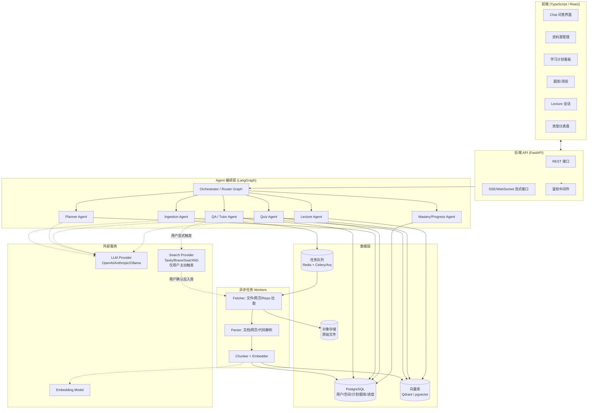

# 03. 系统架构

## 1. 总体架构图

## 2. 组件划分

### 2.1 前端（TypeScript）

- **技术选型**：React + Vite + TypeScript；状态管理用 Zustand/Redux Toolkit（轻量优先）；请求层用 TanStack Query 处理缓存与轮询（摄取任务状态）。
- **Chat/Lecture 界面**：建议基于 `assistant-ui`（开源 React 聊天 UI 库，支持流式、消息编辑、工具调用展示）二次开发，而非从零造轮子，可显著减少 streaming、消息状态管理等基础设施工作量。
- **可视化**：知识图谱用轻量图可视化库（如 react-force-graph 或 vis-network）；学习计划看板可用简单的自研时间线组件。
- **与后端通信**：REST 用于 CRUD（资料源、学习计划、题库配置等）；SSE 或 WebSocket 用于流式问答/Lecture 输出；长任务（摄取）通过任务 ID + 轮询或 WebSocket 推送状态。

### 2.2 后端 API（FastAPI）

- 分层：`api/`（路由） → `services/`（业务逻辑） → `agents/`（LangGraph 编排） → `repositories/`（数据访问）。
- 鉴权：JWT（access + refresh token），中间件校验，资源级别按 `user_id` 过滤。
- 流式响应：FastAPI 的 `StreamingResponse`（SSE）或原生 WebSocket，与 LangGraph 的流式事件（`astream_events`）对接。
- 异步任务：摄取等耗时操作不占用请求线程，提交到任务队列，接口立即返回任务 ID。

### 2.3 Agent 编排层（LangGraph + LangChain）

详见 `06-agent-design.md`。简要原则：

- 用 LangGraph 构建一个**顶层路由图**，根据用户意图（问答/生成计划/生成题目/开始 Lecture）分发到对应子图（sub-graph）。
- 每个子 agent 是一个独立的 LangGraph 子图，拥有自己的状态 schema 和工具集合，便于独立测试和迭代 prompt。
- 检索能力（向量检索、结构化查询）封装为 LangChain 的 Retriever/Tool，供多个 agent 复用，避免重复实现。
- 模型路由：轻量任务（摘要、分类、简单改写）用小/快模型，问答/出题/讲解等质量敏感任务用主力模型，具体供应商通过配置切换（见 NFR，不绑定单一 LLM）。

### 2.4 异步任务 Workers

- 摄取管线（Fetcher → Parser → Chunker/Embedder）拆分为独立任务，通过 Redis 驱动的任务队列（Celery 或更轻量的 Arq）执行，避免阻塞 API 进程，也便于水平扩展 worker 数量。
- 任务状态（排队/运行/成功/失败+原因）写入 PostgreSQL，前端轮询/订阅获取。

### 2.5 数据层

- **PostgreSQL**：结构化数据——用户、学习空间、资料源元数据、学习计划、题库、测验记录、掌握度、对话记录（消息本体可存这里或对象存储，视体量而定）。
- **向量库**：优先建议 **pgvector**（与主库同一 PostgreSQL 实例，运维简单，适合 MVP 规模）；当向量规模/检索 QPS 增长后可平滑迁移到 **Qdrant**（性能更好、检索功能更丰富，如 payload 过滤、混合检索）。两者由 Retriever 接口抽象，替换时业务代码无感。
- **对象存储**：原始上传文件、克隆下来的仓库快照，本地开发用文件系统，生产建议 S3 兼容存储（MinIO 自托管或云厂商 S3）。
- **任务队列**：Redis，同时可复用作缓存（如检索结果短期缓存、限流计数）。

### 2.6 外部服务

- **LLM Provider**：通过统一的 Provider 抽象层接入 OpenAI / Anthropic / 本地 Ollama 等，配置驱动切换，不同 agent 可配置使用不同模型。
- **Embedding 模型**：同样做成可配置项；注意切换 embedding 模型后历史向量需要重新计算，需在设计上标记向量的 `embedding_model_version`。
- **Search Provider**：统一 `SearchProvider` 接口（`search(query, top_k, site_filter) -> [SearchResult]`），实现可选 Tavily / Brave / SerpAPI / 自托管 SearXNG。**仅在用户显式触发时调用**，全局可通过配置关闭；关闭状态下相关 API 返回明确的"能力未启用"，不影响其他功能。搜索结果一旦被用户确认入库，就走与普通 URL 资料源完全相同的 Fetcher→Parser→Chunker 管线，不另开一套摄取路径。

## 3. 关键数据流

### 3.1 资料摄取流程

1. 前端提交资料源（文件上传 / URL / GitHub 链接） → API 创建 `Source` 记录（状态=pending）→ 推送摄取任务到队列。
2. Worker 消费任务：Fetcher 拉取原始内容存对象存储 → Parser 解析为文档树 → Chunker 切块 → Embedder 生成向量 → 写入向量库与 PostgreSQL（chunk 元数据）。
3. 摄取完成后触发 Summarizer 生成资料源摘要与候选知识点，更新学习空间的聚合大纲。
4. 全程更新 `Source.status`，前端轮询/订阅展示进度；出错时记录 `error_message` 并允许单独重试。

### 3.2 问答流程

1. 前端发送问题 + 学习空间 ID + 会话 ID → API → QA Agent。
2. QA Agent 检索向量库获取候选 chunk → （可选）结构化补充信息（如代码符号查询）→ 组装 prompt → 调用 LLM 流式生成 → 边生成边解析引用标记 → SSE 推送给前端。
3. 回答与引用写入对话历史表；触发 Mastery Agent 异步更新相关知识点的"被问及"信号（用于后续掌握度/复习推荐）。

### 3.3 学习计划生成流程

1. 用户提交目标/时间约束 → Planner Agent 读取学习空间的聚合大纲/知识点依赖图 → 生成分阶段计划 → 写入 PostgreSQL → 返回前端渲染看板。
2. 用户打卡/测验结果回流 → Mastery Agent 更新掌握度 → 用户触发"调整计划"时，Planner Agent 基于最新掌握度重新规划剩余阶段。

### 3.4 出题与测验流程

1. 用户设定出题范围/题型/难度 → Quiz Agent 检索对应 chunk → 生成题目+参考答案+知识点标签 → 质量校验（去重/可回答性）→ 写入题库表。
2. 用户作答 → 客观题本地判分，主观题提交给 LLM 批改 → 结果写入测验记录 → 更新掌握度 → 错题写入错题本并计算下次复习时间。

### 3.5 联网检索补充资料流程（仅用户主动触发）

1. 用户点击"联网补充资料"/"联网回答" → API 校验该能力是否启用 + 用户级限流 → 调用 Search Agent。
2. Search Agent 结合学习空间主题上下文生成查询词 → 调用 Search Provider → 汇总去重 → 返回候选列表（不直接入库）。
3. **形态 A（一次性问答）**：抓取选中/前 N 条正文 → 作为临时 context 交给 QA Agent 生成回答 → 回答中的 web 引用与本地资料引用分开标注 → 内容不入库。
4. **形态 B（入库）**：用户勾选候选 → 为每条创建 `type=url, origin=web_search` 的 Source → 走标准摄取管线（3.1）→ 完成后触发大纲重算，新知识点即可被计划/题库/Lecture 使用。

注意：第 2 步与第 4 步之间必须有用户确认这一环，系统不允许把"搜索 → 入库"串成一个无人值守的自动流程。

### 3.6 Lecture 流程

1. 触发 Lecture（基于计划某阶段或用户指定范围）→ Lecture Agent 生成分节大纲 → 逐节流式讲解。
2. 每节末尾插入检验问题，等待用户响应（Agent 图在此暂停，等待人类输入——LangGraph 的 `interrupt` 机制）。
3. 用户打断提问时，临时切换到 QA Agent 子图处理，处理完后恢复 Lecture Agent 的状态继续讲课。

## 4. 部署形态

- **开发环境**：docker-compose 一键起 `api` / `worker` / `postgres`(+pgvector) / `redis` / `frontend`。
- **生产环境**：容器化部署（K8s 或简单的容器服务均可），API 与 Worker 分开伸缩；数据库/向量库/对象存储可选托管服务。
- **本地/隐私优先场景**：支持通过环境变量将 LLM/Embedding 切到本地 Ollama，PostgreSQL/pgvector/MinIO 均可本地部署，实现全链路不出网。

## 5. 可观测性

- 结构化日志：每次 Agent/工具调用记录 trace_id、耗时、token 用量、命中的 chunk id 列表，便于排查"答案为什么不准"。
- 建议接入 LangSmith（或自建的简单调用日志表）用于调试多 agent 调用链路，MVP 阶段可先落库+简单后台页面查看。
- 关键指标监控：摄取成功率、平均检索命中率、问答首字节延迟、LLM 调用失败率与费用。
