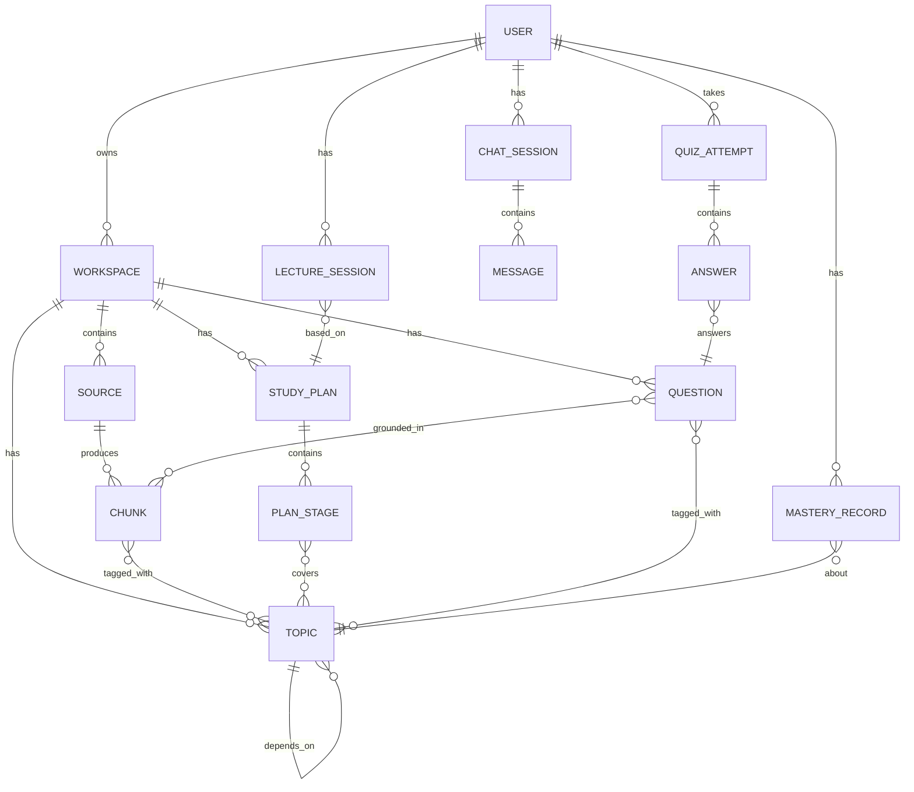

# 04. 核心数据模型

以下为概念级数据模型（非最终 DDL），用于对齐实体关系；后续可直接映射为 SQLAlchemy / Alembic migration。

## 1. ER 概览

## 2. 核心实体说明

### User
- `id`, `email`, `password_hash`（或 OAuth 身份），`locale`（界面/内容语言偏好），`created_at`
- 关联：多个 Workspace、ChatSession、QuizAttempt、MasteryRecord

### Workspace（学习空间）
- `id`, `owner_id`, `name`, `description`, `language`, `status`（摄取聚合状态）, `created_at`
- `outline_json`：聚合后的知识大纲/知识图谱快照（子主题+依赖关系），由摄取完成后的 Summarizer 生成，学习计划/系统讲解/Lecture 均以此为基础
- 关联：多个 Source、Topic、StudyPlan、Question、ChatSession、LectureSession

### Source（资料源）
- `id`, `workspace_id`, `type`（`pdf|docx|pptx|xlsx|md|url|github_repo`）, `title`
- `origin`：原始位置（文件存储路径 / URL / repo 地址 + commit hash）
- `provenance`（`user_upload|user_url|user_github|web_search`）：资料**来源渠道**，用于在 UI 区分"用户自有资料"与"联网检索补充的资料"，并支持按此筛选/批量删除
- `search_query`：仅当 `provenance=web_search` 时有值，记录当初是通过什么查询词搜到的（便于用户回溯"这条资料为什么在这里"）
- `fetched_at`：抓取时间（网页类资料尤其重要，用于判断内容时效性）
- `status`（`pending|fetching|parsing|chunking|embedding|ready|failed`）, `error_message`
- `content_hash`：用于判断增量更新时内容是否变化
- `summary`：该资料源的摘要（供大纲生成/学习计划引用）
- `metadata_json`：类型相关的额外信息，例如：
  - GitHub repo：`{ "default_branch", "commit_sha", "file_count", "primary_languages": [...] }`
  - URL：`{ "crawl_depth", "page_count", "domain" }`

### Chunk（切块）
- `id`, `source_id`, `workspace_id`
- `content`：切块文本
- `position`：定位信息（如 PDF 的页码、Word/Markdown 的标题路径、代码文件的起止行号+函数名、网页的锚点）
- `embedding_ref`：指向向量库中的向量 ID（若向量库与关系库分离存储）
- `chunk_type`（`text|table|code|heading_summary`）

### Topic（知识点/主题）
- `id`, `workspace_id`, `name`, `description`
- `depends_on`：前置主题（自引用多对多，用于拓扑排序生成学习计划/讲解顺序）
- 关联：与 Chunk 多对多（一个知识点可能来自多个资料片段）、与 Question 多对多、被 MasteryRecord 引用

### StudyPlan / PlanStage（学习计划 / 阶段）
- StudyPlan: `id`, `workspace_id`, `user_id`, `goal_description`, `deadline`, `daily_time_minutes`, `status`（`active|completed|archived`）, `version`
- PlanStage: `id`, `study_plan_id`, `order`, `title`, `topic_ids[]`, `estimated_minutes`, `status`（`not_started|in_progress|done`）, `recommended_activities`（阅读/问答/做题/Lecture 的组合建议）

### Question / QuizAttempt / Answer（题库 / 测验）
- Question: `id`, `workspace_id`, `type`（`single_choice|multi_choice|fill_blank|short_answer|code`）, `difficulty`, `stem`, `options_json`（选择题）, `reference_answer`, `explanation`, `topic_ids[]`, `grounded_chunk_ids[]`
- QuizAttempt: `id`, `user_id`, `workspace_id`, `mode`（`practice|exam`）, `started_at`, `submitted_at`, `score`
- Answer: `id`, `quiz_attempt_id`, `question_id`, `user_response`, `is_correct`（客观题）, `ai_score`, `ai_feedback`（主观题）

### ReviewItem（错题本 / 间隔重复队列）
- `id`, `user_id`, `question_id`, `last_result`, `interval_days`, `next_review_at`, `ease_factor`（SM-2 风格参数）

### ChatSession / Message（问答会话）
- ChatSession: `id`, `user_id`, `workspace_id`, `mode`（`strict|augmented`）, `created_at`
- Message: `id`, `chat_session_id`, `role`（`user|assistant`）, `content`, `citations_json`（引用的 chunk 列表及定位）, `web_citations_json`（一次性联网问答时引用的网页：URL、标题、域名、抓取时间；与本地引用分开存储以便前端区分展示）, `used_web_search`（bool，标记该轮回答是否用了联网）, `created_at`

### LectureSession（Lecture 会话）
- `id`, `user_id`, `workspace_id`, `study_plan_stage_id`（可选，关联学习计划阶段）
- `outline_json`：本次 Lecture 的分节大纲
- `current_section_index`, `status`（`in_progress|paused|completed`）
- `transcript`：已讲解内容+互动问答记录

### MasteryRecord（掌握度）
- `id`, `user_id`, `workspace_id`, `topic_id`, `mastery_score`（0-1）, `last_updated_at`, `evidence_count`（有多少次问答/测验信号支撑该分数）

## 3. 向量库中的数据

向量库（pgvector 或 Qdrant）存储：`vector`, `chunk_id`（回指关系库）, `workspace_id`（用于隔离检索范围）, `embedding_model_version`。检索时先按 `workspace_id` 过滤，再做向量相似度检索，必要时结合 `chunk_type`/`topic_id` 做混合过滤（如"只检索代码类 chunk"）。

## 4. 关键索引/约束考虑

- `Source.content_hash` + `Source.workspace_id` 唯一索引，避免重复摄取同一资料。
- `Chunk` 按 `source_id` 建索引，支持"删除资料源时级联删除其 chunk 与向量"。
- `MasteryRecord` 按 `(user_id, workspace_id, topic_id)` 唯一，便于 upsert 更新。
- `ReviewItem.next_review_at` 建索引，支持"今日待复习"查询。
- `Source.provenance` 建索引，支持"只看/只删联网补充的资料"这类筛选操作。
