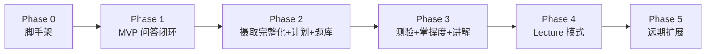

# 08. 路线图

## Phase 0 — 项目脚手架（准备阶段）
- 初始化 monorepo 结构（`frontend/`、`backend/`、`docs/`）
- 后端：FastAPI 项目骨架、PostgreSQL(+pgvector) + Redis 的 docker-compose、鉴权（注册/登录/JWT）
- 前端：Vite + React + TS 骨架，接入 `assistant-ui` 基础 Chat 组件
- 打通"用户注册登录 → 创建空 Workspace"这条最短路径

## Phase 1 — MVP：单文档问答闭环
目标：验证"上传资料 → 问答带引用"的核心体验。

- 资料摄取：仅支持 PDF/Markdown + 单页 URL（暂不做递归抓取和 GitHub repo）
- 摄取管线：Fetcher → MarkItDown 解析 → 简单长度分块 → Embedding → pgvector
- QA Agent（LangGraph）：`retrieve → grade_relevance → generate → citations`，支持严格模式
- 前端：资料上传、摄取状态展示、Chat 界面（流式+引用跳转）
- **验收标准**：上传一份 PDF，针对文中内容提问能得到准确回答并正确引用；问一个文档未覆盖的问题，能得到"资料未覆盖"的诚实回复而非编造。

## Phase 2 — 完整摄取 + 学习计划 + 基础题库
- 资料摄取补齐：Word/PPT/Excel 解析、网址递归抓取（同域名子页面）、GitHub 仓库摄取（含过滤规则、代码/文档分类）
- 大纲/知识点抽取（Summarizer）：摄取完成后生成 workspace 级别的知识大纲与依赖关系
- Planner Agent：根据大纲+用户目标生成分阶段学习计划，前端看板视图
- Quiz Agent：支持选择题/填空/简答的生成与练习模式（先不做正式测验计时、错题本）
- **联网检索补充资料（用户主动触发）**：`SearchProvider` 接入 + 搜索候选列表 + 用户勾选入库（复用 URL 摄取管线）+ 一次性联网问答；含全局开关与用户级限流
- **验收标准**：上传一个 GitHub 仓库 + 其 README/docs，能生成合理的学习计划阶段划分；能基于任意资料源生成可用的练习题并给出解析；能在用户点击后联网搜到相关网页、确认入库并在后续问答中被引用，且**在用户未点击时系统绝不发起任何搜索请求**（需有测试覆盖这一点）。

## Phase 3 — 测验闭环 + 掌握度 + 系统讲解
- 测验模式：限时作答、客观题自动判分、主观题 LLM 判分+反馈
- 错题本 + 间隔重复复习队列
- Mastery Agent：掌握度模型上线，反哺 Planner（动态调整计划）与 Quiz（优先覆盖薄弱点）
- 系统讲解（Explanation）：结构化讲义生成 + 知识图谱可视化
- **验收标准**：完整走通"生成计划 → 学习 → 测验 → 错题复习 → 计划自动调整"闭环。

## Phase 4 — Lecture 模式与体验打磨
- Lecture Agent：分节讲课、节间检验提问、用户打断提问后恢复进度（LangGraph interrupt + checkpoint）
- Lecture 会话的暂停/恢复（跨天继续听课）
- 前端 Lecture 专属界面（进度条、章节导航、互动问答内嵌）
- 性能与体验打磨：流式延迟优化、摄取任务的进度细化、多语言（中英文）内容生成校验
- **验收标准**：可以完整体验一次"讲一节 → 提问检验 → 用户打断问问题 → 回到讲课"的 Lecture 会话。

## Phase 5（远期，非承诺范围）
- 多 LLM/Embedding 供应商的生产级切换与成本看板
- 协作场景：分享学习空间只读链接、多人共用同一课程资料
- 语音/TTS 讲课、移动端适配
- 更丰富的题型（拖拽排序、图表标注题）与代码题的沙箱执行评测

## 里程碑间的依赖关系

## 风险与关注点

| 风险 | 应对 |
|---|---|
| GitHub 大仓库摄取耗时/成本过高 | 设置大小上限，支持"选择子目录/特定文件类型"摄取，参考 gitingest 的过滤策略 |
| 出题质量（生成的题目在资料中找不到依据） | Quiz Agent 增加 `validate` 校验节点，生成后二次校验可回答性 |
| Lecture 的 interrupt/恢复机制实现复杂度 | Phase 4 单独排期，Phase 1-3 先不依赖该机制验证其他闭环 |
| 幻觉/资料覆盖不足导致答案不可信 | QA Agent 的 `grade_relevance` 节点是硬性关卡，宁可拒答不编造，作为贯穿所有阶段的质量红线 |
| 联网检索引入低质量内容或提示注入，稀释"资料第一性"的产品价值 | 工具门控（`allow_web_search` 状态位而非 prompt 约束）+ 入库前用户确认 + 来源与抓取时间始终可见 + 网页正文按数据而非指令处理 |
