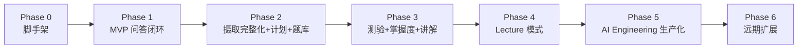

# 08. 路线图

## Phase 0 — 项目脚手架（准备阶段）
- 初始化 monorepo 结构（`frontend/`、`backend/`、`docs/`）
- 后端：FastAPI 项目骨架、PostgreSQL(+pgvector) + Redis 的 docker-compose、鉴权（注册/登录/JWT）
- 前端：Vite + React + TS 骨架，接入 `assistant-ui` 基础 Chat 组件
- 打通"用户注册登录 → 创建空 Workspace"这条最短路径

## Phase 1 — MVP：单文档问答闭环
目标：验证"上传资料 → 问答带引用"的核心体验。

- 资料摄取：仅支持 PDF/Markdown + 单页 URL（暂不做递归抓取和 GitHub repo）
- 摄取管线：Fetcher → MarkItDown 解析 → 简单长度分块 → Embedding → pgvector
- QA Agent（LangGraph）：`retrieve → grade_relevance → generate → citations`，支持严格模式
- 前端：资料上传、摄取状态展示、Chat 界面（流式+引用跳转）
- **验收标准**：上传一份 PDF，针对文中内容提问能得到准确回答并正确引用；问一个文档未覆盖的问题，能得到"资料未覆盖"的诚实回复而非编造。

当前状态（2026-07-30）：

- [x] Source 与 Workspace 摄取状态完整归并，覆盖成功、失败、重试和删除。
- [x] 严格问答、流式输出、引用悬浮与点击打开原资料。
- [x] 自动化验收覆盖“资料内回答带引用”和“资料外明确拒答”。
- [x] PDF 摄取保留原始页码，引用携带页码并可打开上传 PDF 的对应页面。
- [ ] 发布验收继续补充扫描 PDF、复杂公式以及精确页码定位的真实样本。

## Phase 2 — 完整摄取 + 学习计划 + 基础题库
- 资料摄取补齐：Word/PPT/Excel 解析、网址递归抓取（同域名子页面）、GitHub 仓库摄取（含过滤规则、代码/文档分类）
- 大纲/知识点抽取（Summarizer）：摄取完成后生成 workspace 级别的知识大纲与依赖关系
- Planner Agent：根据大纲+用户目标生成分阶段学习计划，前端看板视图
- Quiz Agent：支持选择题/填空/简答的生成与练习模式（先不做正式测验计时、错题本）
- **联网检索补充资料（用户主动触发）**：`SearchProvider` 接入 + 搜索候选列表 + 用户勾选入库（复用 URL 摄取管线）+ 一次性联网问答；含全局开关与用户级限流
- **验收标准**：上传一个 GitHub 仓库 + 其 README/docs，能生成合理的学习计划阶段划分；能基于任意资料源生成可用的练习题并给出解析；能在用户点击后联网搜到相关网页、确认入库并在后续问答中被引用，且**在用户未点击时系统绝不发起任何搜索请求**（需有测试覆盖这一点）。

当前状态（2026-07-30）：

- [x] Word/PPT/Excel、同路径递归网页、链接 PDF 与 GitHub 快照摄取。
- [x] 逐跳 SSRF 校验、抓取深度/页数上限、仓库体积/文件数/clone 超时保护。
- [x] Workspace 大纲与依赖、Planner 确定性排序/预算校验及计划版本保留。
- [x] Chat 内随堂练习、四类基础题型、格式去重和基于资料的二次语义校验。
- [x] 显式联网候选/确认入库/一次性回答，以及“未触发绝不搜索”的自动化测试。
- [x] Web task 增加代码级授权门：部署开关与用户明确请求缺一不可，Router 无法自行授权联网。
- [ ] 发布验收补充真实 GitHub 大仓库 → 大纲 → 学习计划，以及联网入库 → 后续引用的完整回归样本。

## Phase 3 — 测验闭环 + 掌握度 + 系统讲解
- 测验模式：限时作答、客观题自动判分、主观题 LLM 判分+反馈
- 错题本 + 间隔重复复习队列
- Mastery Agent：掌握度模型上线，反哺 Planner（动态调整计划）与 Quiz（优先覆盖薄弱点）
- 系统讲解（Explanation）：结构化讲义生成 + 知识图谱可视化
- **验收标准**：完整走通"生成计划 → 学习 → 测验 → 错题复习 → 计划自动调整"闭环。

当前状态（2026-07-30）：

- [x] Chat 内正式测验支持题库抽题、倒计时、断点恢复、提交前隐藏答案和超时状态。
- [x] 单选/多选/填空程序化判分，简答题使用 Smart 档模型给出部分分与反馈；实际模型和结果显示在批改调用链。
- [x] 错题自动进入复习队列，答题后使用有上限的 SM-2 调度下一次复习。
- [x] 主题掌握度按新证据持续更新；Quiz 优先最弱主题，Planner 读取掌握度。
- [x] 测验薄弱点自动生成含“定向复习”阶段的新计划版本，旧版本保留。
- [x] QA、讲解、随堂练习、正式测试、错题复习和掌握度统一由 Chat Router 分发，并以对话内卡片完成交互。
- [x] Router 输出置信度、候选意图和理由；不确定时暂停任务并让用户点击选择后续方向。
- [x] Router 支持单轮多 Agent 任务计划；Web 与 RAG 并发收集原始上下文，统一拼接和编号后只调用一次 Answer Agent。
- [x] Explanation Agent 在 Chat 中输出引用原文的结构化讲义与知识依赖图，不再维护独立功能页。
- [x] 自动化验收覆盖“测验 → 判分 → 错题 → 复习 → 掌握度 → 自动调整计划”。
- [x] 测验提交支持并发幂等；慢速评分不占用读取事务，最终结果与学习状态在行锁内原子写入。
- [ ] 发布验收补充真实资料上的主观题评分一致性、讲解引用质量和移动端计时恢复。

## Phase 4 — Lecture 模式与体验打磨
- Lecture Agent：分节讲课、节间检验提问、用户打断提问后恢复进度（LangGraph + PostgreSQL durable checkpoint）
- Lecture 会话的暂停/恢复（跨天继续听课）
- 与 Chat 平级的 Lecture 模块：课程列表、专属页面、进度条、章节导航、检验题和暂停/恢复控制；底层复用共享对话 runtime
- 性能与体验打磨：流式延迟优化、摄取任务的进度细化、多语言（中英文）内容生成校验
- **验收标准**：可以完整体验一次"讲一节 → 提问检验 → 用户打断问问题 → 回到讲课"的 Lecture 会话。

当前状态（2026-07-30）：

- [x] Router 增加 `lecture` 意图；开始、继续、暂停和结束都从 Chat stream 进入。
- [x] Lecture LangGraph 基于计划、掌握度与 RAG 资料生成有引用的分节大纲、小节讲解和理解检验题。
- [x] `LectureSession` 持久化大纲、当前节、待回答问题和小节历史，支持刷新、暂停和跨天恢复。
- [x] 待回答输入使用 Fast 档区分“作答 / 插问”；插问委托 QA Agent 后保持原讲课位置。
- [x] 检验题由 Smart 档评分并回流掌握度；参考答案不进入 artifact 或调用链。
- [x] Chat 内进度卡片展示章节、当前状态和控制按钮，旧卡片不可再次操作。
- [x] Workspace 增加与 Chats 平级的 Lectures 入口、历史列表和专属 Lecture Studio 路由。
- [x] Lecture 列表/详情成为一等 API 资源，同时隐藏待答题参考答案。
- [x] Lecture 全部结构化调用统一进行本地 JSON 修复、schema 校验和一次模型修复；评分真正失败时保留 checkpoint/Mastery，并持久化“重试评分”动作后正常结束 SSE。
- [x] 路由初始 query 一次性消费，后端使用 `request_id` 幂等键，避免刷新/HMR 重复发起同一 Lecture。
- [x] 自动化验收覆盖“讲解 → 作答 → 暂停 → 恢复 → 插问 → 回到检验 → 完成”。
- [ ] 使用真实中英文教材验证大纲顺序、讲解引用质量、重启恢复和首段响应延迟。
- [ ] 细化大文件摄取进度，并完成移动端 Lecture 卡片体验验收。
- [ ] 设计并实现按小节版本化的 narration/audio/video 异步媒体生成流水线与播放器。

## Phase 5 — AI Engineering 生产化

- 统一 AI Evaluation Platform：版本化 dataset、可插拔 suite、逐 case 结果、baseline 比较、回归 gate 和 Dashboard。
- Observability：持久化 Agent run/span、延迟分解、token/成本与错误分类，支持按模型和 Agent 聚合。
- Task DAG / durable execution：显式依赖、共享 blackboard、幂等 worker、重试/降级与部分结果恢复。
- Multi-Agent coordination benchmark：比较单 Agent、并发 fan-out、监督者/worker 在质量、延迟、成本上的 trade-off。
- Prompt Registry：稳定 key、不可变版本、workspace override、变量契约、内容 hash、Eval 快照与 Replay。
- Agent Security / Red Team：输入、外部 context、输出和工具权限四个边界的运行时策略与持续红队 gate。
- Resource Governance：请求级成本预算、workspace cache、single-flight、外部依赖熔断与故障注入评测。
- **验收标准**：每次发布有可复现的质量基线；关键指标退化会阻止发布；一次线上失败能定位到具体 Agent、模型、输入版本和 span。

当前状态（2026-07-31）：

- [x] `EvalDataset → EvalCase → EvalRun → EvalResult` 统一持久化模型与 Alembic migration。
- [x] Suite registry、通用 Runner、逐 case checkpoint、异常隔离、指标聚合与 token/成本记录。
- [x] Run 快照模型分层、embedding/reranker 配置与 Git SHA；Result 保存实际 model calls。
- [x] 绝对指标下限和相对 baseline 最大回归 gate；执行状态与质量状态分离。
- [x] Structured Output、Router Contract、RAG Retrieval 三个首批适配器。
- [x] Workspace Evaluation Dashboard：starter/import、异步运行、baseline 和 case 下钻。
- [x] `make eval-fast` 与 GitHub Actions 无模型回归 gate，覆盖 35 个 golden/adversarial/security/governance cases。
- [x] OpenTelemetry SDK 与 FastAPI、HTTPX、SQLAlchemy instrumentation；OTLP/console/none 可配置导出。
- [x] AgentRun / AgentSpan 持久化、统一 trace ID、Agent waterfall、模型调用 token/成本和错误聚合。
- [x] Workspace Observability Dashboard 与隔离 Replay；对比 latency、token、cost 和输出变化，不污染 Chat 历史。
- [x] `OTEL_CAPTURE_CONTENT` 隐私开关；关闭内容留存时继续采集指标并禁止 Replay。
- [x] Router 任务升级为 Typed Task DAG：稳定 ID、typed node、显式依赖、拓扑校验与旧格式归一化。
- [x] DAG Executor 支持同层并发、共享 blackboard、节点超时/重试和依赖失败传播。
- [x] Web + RAG + Answer 改为显式 fan-out/fan-in；DAG 节点状态进入调用链、AgentRun 和 Replay。
- [x] 前端调用链可视化 DAG 的并行层、依赖层、状态、尝试次数，并保留完整 Raw JSON。
- [x] Multi-Agent Coordination suite：single-agent、Typed DAG、顺序 DAG、无 synthesis 四策略消融。
- [x] Deterministic benchmark 进入 CI；Dashboard 支持一键 ablation matrix、live matrix 和跨策略指标表。
- [x] 建立 Agent Engineering Log，并用仓库级规则要求后续 Agent 优化同步记录问题、方案和验证。
- [x] Prompt Registry 首版：11 个关键 Agent prompt 版本化，支持 draft/activate/rollback/builtin fallback。
- [x] Prompt 版本进入 Chat 调用链、usage、AgentRun 与 EvalResult；Replay 支持 current/original 两种模式。
- [x] 统一 Agent Security policy：输入 extraction/exfiltration 拒绝、RAG/Web context quarantine、输出 credential guard。
- [x] Web 工具授权统一为 deployment + explicit consent；安全判定进入 Chat 调用链和 AgentRun/Span。
- [x] Agent Security 红队 suite：14 个 attack/benign cases、6 类指标、Dashboard starter 与 CI gate。
- [x] 单 turn 预算 reservation/reconciliation：soft limit Smart→Fast，hard call/token/cost limit fail-closed。
- [x] Router 与 Web Search workspace 隔离 Redis cache、内容哈希 key 和进程内 single-flight。
- [x] LLM/Web/reranker Redis 分布式 closed/open/half-open 熔断；Redis outage 进入本地降级。
- [x] Resource Governance 调用链、Usage、AgentRun/Span、OTel 指标与 5-case fault-injection Eval suite。
- [ ] 增加调用真实 Router 模型的语义准确率 suite，并从匿名化对话 failure 中沉淀 production cases。
- [ ] 增加 RAG answer faithfulness/correctness judge、Lecture 状态机和 multi-agent coordination suites。
- [ ] 实现 production failure 一键提升为 Eval Case、nightly paid eval 和 release baseline promotion。
- [x] DAG 节点独立 durable checkpoint：稳定 execution key、materialized result、worker lease、原 DAG 恢复与调用链标记。
- [x] 发布 480-sample deterministic、48-sample live pilot、bootstrap 95% CI 与完整 case-level JSON。
- [x] 200-turn/50-concurrency resilience profile 与 500-request HTTP readiness SLO 报告进入可复现 CLI；CI 运行 smoke profile。
- [ ] Typed DAG 可选依赖、部分结果降级，以及有副作用 tool 的 provider-side idempotency key。
- [ ] 将 live multi-agent matrix 扩展到每策略 30+ repeats 后再对稳定收益做公开结论。

## Phase 6（远期，非承诺范围）

- 协作场景：分享学习空间只读链接、多人共用同一课程资料。
- 语音/TTS 讲课、移动端适配。
- 更丰富的题型（拖拽排序、图表标注题）与代码题的沙箱执行评测。

## 里程碑间的依赖关系

## 风险与关注点

| 风险 | 应对 |
|---|---|
| GitHub 大仓库摄取耗时/成本过高 | 设置大小上限，支持"选择子目录/特定文件类型"摄取，参考 gitingest 的过滤策略 |
| 出题质量（生成的题目在资料中找不到依据） | Quiz Agent 增加 `validate` 校验节点，生成后二次校验可回答性 |
| Lecture 的 interrupt/恢复机制实现复杂度 | Phase 4 单独排期，Phase 1-3 先不依赖该机制验证其他闭环 |
| 幻觉/资料覆盖不足导致答案不可信 | QA Agent 的 `grade_relevance` 节点是硬性关卡，宁可拒答不编造，作为贯穿所有阶段的质量红线 |
| 联网检索引入低质量内容或提示注入，稀释"资料第一性"的产品价值 | 工具门控（`allow_web_search` 状态位而非 prompt 约束）+ 入库前用户确认 + 来源与抓取时间始终可见 + 网页正文按数据而非指令处理 |

## 持续集成

- GitHub Actions 在 PostgreSQL + pgvector 与 Redis 服务上执行全部后端迁移、Ruff、无模型 Eval regression gate 和 pytest。
- 前端执行 Vitest、oxlint 与生产构建；真实资料和付费模型评测进入 nightly/release workflow，不能由单元测试替代。
