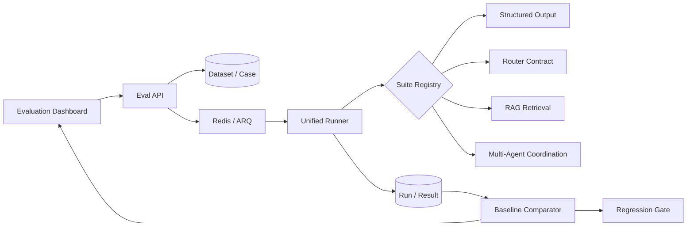

# 10. 统一 AI Evaluation Platform

## 目标

把 Router、结构化输出、RAG 以及后续 Lecture / Multi-Agent 的质量验证收进同一套实验系统，而不是让每个 Agent 各自写一次性脚本。平台需要回答四个工程问题：

1. 这次运行使用了哪一版 golden set、模型、检索配置和代码？
2. 总体指标是否改善，具体是哪些 case 退化？
3. 相对已发布 baseline 的下降是否超过允许阈值？
4. 哪些检查可以无模型地进入每次 CI，哪些需要真实语料或付费模型定期运行？

## 架构



核心代码位于 `backend/app/evaluation/`。Suite 只负责“如何执行一个 case 并给出标准化 scores”；Runner 统一负责计时、token/成本采集、逐 case checkpoint、聚合、baseline 比较和异常隔离。

## 数据模型

| 实体 | 作用 |
|---|---|
| `EvalDataset` | 有版本的 golden/adversarial/distribution 数据集；保存默认运行配置和质量阈值 |
| `EvalCase` | 单条输入、预期、tags、metadata 和稳定 key |
| `EvalRun` | 一次实验；快照 suite、variant、运行时模型、Git SHA、baseline、summary 与 gate 结果 |
| `EvalResult` | 每个 case 的输出、scores、明细、耗时、token、成本、实际模型调用和错误 |

Dataset 在 Workspace 内隔离并归属当前用户。删除 Dataset 会级联删除其 Case、Run 和 Result；baseline 被删除时只解除引用。

## 内置 suites

| Suite | 类型 | 指标 | 当前用途 |
|---|---|---|---|
| `structured_output` | 确定性 | contract accuracy、parse success、exact match | 防止 JSON fence、尾逗号、Python literal、字符串内花括号等恢复逻辑退化 |
| `router_contract` | 确定性 | contract、intent、task plan accuracy | 验证 Router 输出解析、澄清判断、Web → RAG 多 Agent 顺序和 action 组合保护 |
| `rag_retrieval` | 真实 Workspace | Recall@1/3/5、MRR | 复用现有 dense / sparse / RRF / rerank 变体，评估真实检索链 |
| `multi_agent_coordination` | 确定性 / 真实模型 | quality、claim/citation/order、latency/cost efficiency | 对比 single-agent、Typed DAG、顺序 DAG 和无 synthesis 消融 |

`router_contract` 不调用模型，它验证模型输出到执行计划之间的契约，因此适合每次 CI。Router 的真实语义准确率需要另建带用户 query 的 model-based suite；不能用 parser 测试冒充。

`multi_agent_coordination` 使用同一 question、Web/Local evidence 和 expected claims
改变协调策略。deterministic 模式进入 CI；live 模式调用实际 Fast/Smart 模型并记录
真实 token、成本和关键路径。完整实验契约见
[Multi-Agent Benchmark](14-multi-agent-benchmark.md)。

## 运行与回归规则

Run 经历 `pending → running → completed|failed`。ARQ worker 每完成一个 case 就提交一次结果；worker 重启时会把遗留的 running Run 重新排队，Runner 跳过已有 Result，只继续未完成的 case。Case 自身报错会记录为 error 并继续执行后续 case；Runner 基础设施异常才把整个 Run 标为 failed。

Dataset 的 `thresholds` 支持：

```json
{
  "min_scores": {
    "contract_accuracy": 1.0,
    "recall@5": 0.9
  },
  "max_regression": {
    "recall@5": 0.02,
    "mrr": 0.01
  }
}
```

- `min_scores`：当前绝对质量下限。
- `max_regression`：相对 baseline 最多允许下降多少；未配置的指标仍显示 delta，但不阻塞 gate。
- Run 的执行状态与质量 gate 分离：执行成功但质量下降的结果是 `completed + gate_passed=false`，而不是伪装成基础设施失败。

## API 与 Dashboard

Workspace 的 `Evaluations` 页可以：

- 创建 Router / Structured Output starter golden set；
- 导入自定义 JSON cases；
- 启动异步评测；
- 自动选择同 Dataset 最近完成的 Run 作为 baseline；
- 查看 aggregate metrics、delta、regression 和逐 case 输出。

主要 API：

```text
GET    /workspaces/{id}/evals/suites
GET    /workspaces/{id}/evals/datasets
POST   /workspaces/{id}/evals/datasets
POST   /workspaces/{id}/evals/datasets/starter
GET    /workspaces/{id}/evals/datasets/{dataset_id}
DELETE /workspaces/{id}/evals/datasets/{dataset_id}
POST   /workspaces/{id}/evals/datasets/{dataset_id}/runs
GET    /workspaces/{id}/evals/runs
GET    /workspaces/{id}/evals/runs/{run_id}
```

## CI 分层

```bash
# 16 个无网络、无数据库、无模型的 golden/adversarial/coordination cases
make eval-fast

# 完整单元与集成测试
make test
```

GitHub Actions 在 backend tests 前执行 `eval-fast`。RAG 和未来 LLM-as-judge suites 不放进每次 PR 的快速 gate：它们应在具有固定语料、真实凭据和预算上限的定时或发布前工作流运行，并把 Run 与选定 baseline 保存在数据库中。

## 扩展一个 Agent 评测

1. 在 `app/evaluation/suites/` 实现 `EvaluationSuite`，声明 `SuiteInfo`。
2. 返回统一的 `EvaluationOutcome(passed, output, scores, details)`。
3. 在 suite 模块末尾注册，并由 `suites/__init__.py` 导入。
4. 建立至少三类 case：常规 golden、已知 failure/adversarial、接近真实流量分布的样本。
5. 给关键指标设置绝对下限和允许回归幅度，再决定是否进入 PR、nightly 或 release gate。
