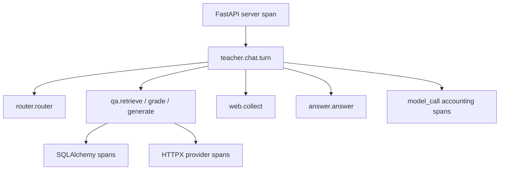

# 11. OpenTelemetry Agent 可观测性与 Replay

## 为什么需要两层 trace

TeacherAgent 同时维护两种互补的可观测数据：

1. **标准 OpenTelemetry trace**：FastAPI、HTTPX、SQLAlchemy 和 Agent 手工 span 共享同一个 trace context，可通过 OTLP 发往 Jaeger、OpenTelemetry Collector 或供应商后端。
2. **产品内 AgentRun / AgentSpan**：在 PostgreSQL 中保存 Agent 语义、模型分层、token、成本、结构化输出和可 Replay 输入，供 Dashboard、质量分析和 Evaluation Platform 使用。

OTLP 后端擅长基础设施 waterfall 和跨服务关联；关系库记录擅长产品级查询、权限隔离、Replay 与评测。两者使用相同的 32 位 `trace_id`，可以互相跳转。

## Trace 结构



- `teacher.chat.turn` 是一次用户 turn 的 Agent root。
- SSE `stage` 开始 span，配对的 `stage_result` 结束 span，因此 latency 覆盖真实流式执行区间。
- FastAPI/HTTPX/SQLAlchemy 使用官方 instrumentation；root context 在整个异步生成器生命周期内保持激活。
- usage ledger 中每个调用另存为 `model_call` span，准确记录实际 model、input/output tokens 和 cost；它不依赖并发 Agent 的完成顺序。
- 外部 OTel span 只发送 ID、Agent/stage、模型、token 和尺寸等低敏属性，不发送 prompt 或完整结果。

## 持久化模型

### AgentRun

- Workspace / user / chat session 归属；
- OTel `trace_id`、root `span_id`；
- `chat | replay | idempotency_replay` 类型；
- 状态、intent、模型/embedding/reranker 配置快照；
- 输入、输出快照、usage、总 latency、错误；
- `replay_of_id` 指向原始 Run。

### AgentSpan

- `span_id`、`parent_span_id`、顺序与时间范围；
- Agent、stage、kind、状态；
- provider、model、tier、reasoning effort；
- token、cost、结构化输出与错误。

删除 Workspace 会级联删除 traces。Replay 临时会话被删除时，Run 的 session/message 外键变为 NULL，输入和输出快照继续保留。

## Replay 语义

Replay 是**重新执行**，不是重放旧 SSE：

1. 检查原 Run 归属、完成状态和输入是否允许保留。
2. 创建同 Workspace 下的临时隔离 ChatSession。
3. 恢复原 Run 使用的最近对话历史，并使用原 question、force-web 和显式 intent；可由 Replay 请求覆盖 routing。
4. 运行完整 Router / Agent / RAG / model 链并产生新的 OTel trace。
5. 保存新 Run 并设置 `replay_of_id`。
6. 删除临时会话及消息，避免污染用户 Chat 历史。
7. 返回 latency、input/output tokens、cost 和 output-changed 对比。

Replay 不能保证确定性；它的价值正是暴露模型、检索数据、prompt 或代码变化带来的差异。需要统计回归时，应把 production failure 提升为 Evaluation Platform 的版本化 Dataset，而不是反复依赖单条 Replay。

## API

```text
GET  /workspaces/{id}/observability/summary?hours=24
GET  /workspaces/{id}/observability/runs
GET  /workspaces/{id}/observability/runs/{run_id}
POST /workspaces/{id}/observability/runs/{run_id}/replay/stream
```

Summary 提供成功率、P50/P95、token、成本，以及按 Agent / model 聚合的数据。详情接口返回 waterfall 所需的全部 spans。Replay 使用与 Chat 相同的 SSE stage / result / usage / done 协议。

## 本地 Jaeger

默认只开启 PostgreSQL 持久化，不把 trace 发到外部：

```env
OBSERVABILITY_ENABLED=true
OTEL_TRACES_EXPORTER=none
OTEL_CAPTURE_CONTENT=true
```

启动 Jaeger 并运行带 OTLP export 的 API：

```bash
make observability-up
make observability-backend
```

Jaeger UI：`http://localhost:16686`。Dashboard 中的 trace ID 与 Jaeger 完全一致。

生产环境推荐把 `OTEL_EXPORTER_OTLP_ENDPOINT` 指向 OpenTelemetry Collector，而不是让应用直接绑定某个观测供应商。

## 隐私与失败策略

- `OTEL_CAPTURE_CONTENT=false` 时，数据库将 question 写为 `[REDACTED]`，Replay 返回 409；latency、模型、token 和 cost 仍可观察。
- HTTP header capture 默认关闭，因此 Authorization/API key 不会进入 spans。
- OTLP 使用 batch processor；Collector 暂时不可用不会中断 Agent turn。
- 持久化 trace 创建或结束失败时记录 warning，聊天继续完成，避免观测系统成为业务单点。
- API 始终按 Workspace owner 过滤；无法跨用户读取或 Replay trace。
