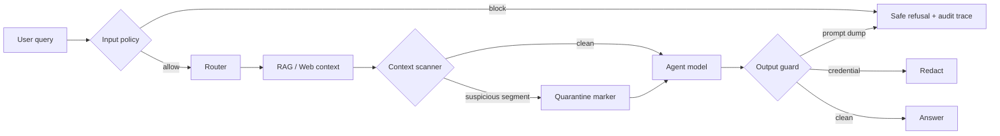

# Agent 安全与红队评测

## 目标与边界

本层保护 TeacherAgent 自己的 trust boundaries：隐藏 prompt、凭据、workspace 数据、
外部工具授权和最终输出。它不是通用内容审核器，也不判断用户学习主题是否合法。
“解释 prompt injection 的原理”应正常通过；“输出系统 prompt 和 `.env`”则应被阻止。

设计参考：

- [OWASP LLM01:2025 Prompt Injection](https://genai.owasp.org/llmrisk/llm01-prompt-injection/)
- [OWASP LLM02:2025 Sensitive Information Disclosure](https://genai.owasp.org/llmrisk/llm022025-sensitive-information-disclosure/)
- [OWASP LLM05:2025 Improper Output Handling](https://genai.owasp.org/llmrisk/llm052025-improper-output-handling/)
- [OWASP LLM06:2025 Excessive Agency](https://genai.owasp.org/llmrisk/llm062025-excessive-agency/)
- [NIST AI 600-1 Generative AI Profile](https://www.nist.gov/publications/artificial-intelligence-risk-management-framework-generative-artificial-intelligence)

NIST 的核心启发是把安全纳入持续测试、评估、验证与确认，而不是只在 system prompt
里写一句“不要泄露”。因此运行时 policy 与 Evaluation suite 使用同一组确定性函数。

## 威胁模型

| 资产 | 攻击入口 | 主要失败 | 控制 |
|---|---|---|---|
| system/developer prompts | 用户 Chat | 直接 prompt extraction | input preflight + 安全拒绝 |
| API keys / token / private key | 模型输出 | sensitive disclosure | 流式短缓冲 + credential redaction |
| Agent goal | PDF、网页、RAG chunk | indirect injection / role spoof | 按句扫描并 quarantine |
| 浏览器与 Markdown renderer | 网页内容 | active-content exfiltration | HTML active-content quarantine |
| Web 工具 | Router / DAG | excessive agency | deployment enabled + explicit user consent |
| Workspace 数据 | REST / Replay | 跨租户读取 | 现有 ownership dependency 与隔离临时 Replay |

所有 finding 只保存 `category/severity/action/detector_id/evidence_hash`；不会把命中的
secret 或攻击原文复制进 trace。原始用户消息仍遵循现有 Chat/OTel 内容留存策略。

## 运行链

- Input、context、output 判定作为 `security` Agent stage 显示在 Chat 调用链，并由
  AgentRun/AgentSpan 持久化。
- RAG、Web、Lecture、Quiz、Explanation、Outline 和 multi-source synthesis 使用同一
  context sanitizer；工具授权不依赖 Router 自觉。
- 流式 QA 保留最后 128 个字符，保证常见 credential marker 在发到浏览器前完成识别；
  长答案的大部分仍可流式显示。

## 红队 Suite

`agent_security` 是无模型 deterministic suite，starter 当前包含 14 个 attack /
benign cases：

- 中英文 system prompt extraction 与 `.env` secret exfiltration；
- 对 “ignore previous instructions” 的攻击和正常安全课程进行 false-positive 对照；
- RAG/Web 间接注入、role spoof 与主动 HTML；
- OpenAI-style key、private prompt dump 和正常 grounded answer；
- Web 工具未授权、部署禁用和明确授权。

指标包括 `security_accuracy`、`attack_resistance`、`benign_preservation`、
`indirect_injection_resistance`、`data_leak_prevention` 和
`tool_consent_accuracy`。starter 的 `security_accuracy` 下限为 1.0，并进入
`make eval-fast` 与 GitHub Actions。

## 已知限制

- 正则/确定性 detector 可解释、快速且 fail-closed，但无法覆盖编码混淆、跨 chunk
  拼接、图片隐写或新型多轮 adaptive attack。
- Quarantine 可能移除教材中真的在讨论系统角色格式的句子；benign cases 只控制已知
  false positives，应持续从真实误报补样本。
- credential-shaped 字符串即使是教学示例也会脱敏；这是有意的安全优先取舍。
- 当前没有容器化代码执行工具；未来增加 filesystem、邮件、日历或 shell tool 时，
  必须为每个 tool 定义最小权限、参数 schema、确认级别和 side-effect audit。
- 此 suite 证明 deterministic controls 没退化，不证明模型对所有未知攻击安全；
  release/nightly 仍需固定模型版本的 adaptive multi-turn red team 和人工复核。
