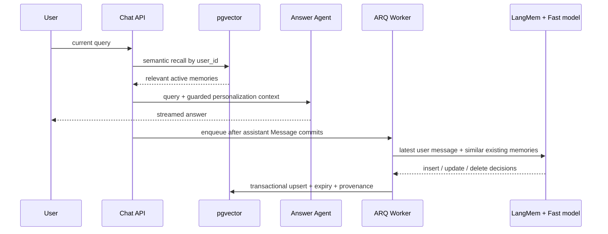

# 用户长期记忆

## 1. 目标与工具选择

长期记忆只保存会影响未来协作的用户信息：表达偏好、相关背景和长期目标。它不是聊天记录摘要，
也不能作为教材事实的证据。

本项目使用 [LangMem](https://langchain-ai.github.io/langmem/) 做结构化提取和已有记忆的
insert/update/delete 决策，继续使用已有 PostgreSQL + pgvector 保存和检索。LangMem 原生支持
Pydantic memory schema 以及与已有 memories 比较后更新；使用现有数据库则能保留 tenant FK、
来源、置信度、过期时间和产品 CRUD。没有引入 Mem0 SaaS、Zep/Graphiti 或第二套向量数据库，
因为当前需求不需要额外的托管层或知识图谱运维面。

## 2. 数据流



Recall is synchronous but fail-open: embedding or database failure is shown in the call chain and the answer continues
without memory. Extraction is asynchronous: Redis/provider failure never turns a successful Chat response into an
error. `messages.memory_processed_at` makes retries idempotent; ARQ retries a failed job up to three times.

## 3. 提取、冲突和重复合并

`ExtractedUserMemory` 限定为三个 kind，并要求稳定的 `memory_key`：

- `preference`：例如回答详略、语言、学习呈现方式；
- `background`：例如职业、已有技能和与后续帮助相关的经验；
- `goal`：例如转型 AI Engineer 这类跨会话目标。

便宜的中英文 durable-fact cue 先排除普通知识问题，避免每轮额外调用模型；命中后 Fast tier
在后台比较语义最相近的现有记录。相同 `user_id + memory_key` 只能存在一条记录，新陈述更新
旧值；模型也可以删除用户明确撤回的自动记忆。用户在 UI 新建或修改的记录会变成
`user_confirmed=true`，自动任务不得覆盖或删除它。

提取 prompt 明确排除 secrets、credentials、身份号码、联系方式、医疗/信仰/财务等敏感推断，
也不保存助手或教材声称的事实。记忆文本在 Answer prompt 中被标记为 untrusted personalization
data：可以改变呈现方式，不能覆盖 system/safety，也不能代替 RAG/Web evidence。

## 4. 召回、置信度和遗忘

召回先按 pgvector cosine distance 取候选，再组合：

```text
score = 0.60 * semantic_similarity
      + 0.25 * effective_confidence
      + 0.10 * importance
      + 0.05 * same_workspace_origin
```

自动记忆按半衰期衰减：`confidence * 0.5 ** (age_days / half_life_days)`；成功召回会更新
`last_accessed_at` 和 `access_count`。低于 confidence 或总分阈值的记录不进入 prompt。
自动记录默认 365 天过期，ARQ 每日清理；每个用户默认最多 200 条，超限时优先清理低置信度、
最旧且未确认的记录。用户确认的记录有效置信度固定为 1，并且可以设置无过期时间。

## 5. 用户治理与 API

Workspace 的 `Memory` 页展示该用户的全局记忆，而非只展示当前 workspace：

- 查看 kind、有效置信度、自动提取/用户确认、过期时间和召回次数；
- 按类型或文本过滤；
- 手工新增、修改内容/kind/过期时间；
- 永久删除单条记忆。

REST endpoints：

- `GET/POST /api/v1/workspaces/{workspace_id}/memories`
- `PATCH/DELETE /api/v1/memories/{memory_id}`

所有读写都以认证用户的 `user_id` 过滤；workspace dependency 只用于验证访问入口归属和记录
来源。数据库 FK 在删除 user 时级联清除全部记忆，删除来源 workspace/session/message 只将来源
置空，不意外删除用户的全局记忆。

## 6. 可观测性与剩余限制

Chat 调用链展示 `memory_recall` 的 embedding provider/model、命中内容与分数；需要写入时展示
`memory_write` 的 Fast 模型和后台排队状态。Prompt Registry 包含 `memory.extract v1`，便于按
workspace 版本化提取策略。

当前限制：durable-fact cue 可能漏掉非常隐含的个人信息；后台 LangMem 调用不属于原 Chat turn
预算，改由队列 timeout、重试和每用户容量约束；没有实现跨用户共享记忆、知识图谱关系或一键
导出；用户删除是 hard delete，若产品进入合规环境还需补充 data-export 和审计保留策略。
